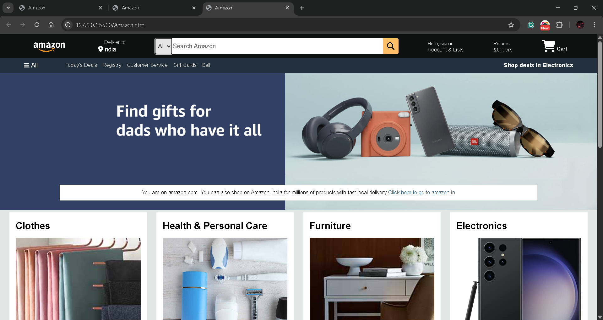

<h1 align="center">🛒 Amazon Homepage Clone</h1>

  <b>A static clone of the Amazon.com homepage built with HTML & CSS</b> 
  A personal practice project to improve frontend skills — layout, styling, and attention to detail.

  
  
  

---

## 📸 Project Preview

  

---

## 🚀 Features
✔ Amazon-like navigation bar with logo, search bar & cart icon  
✔ Hero section with promotional banner  
✔ Multiple product category cards  
✔ Footer with multi-column links  

---

## 🛠 Tech Stack
- **HTML5** — semantic structure
- **CSS3** — Flexbox, Grid, custom styling

---

## 📂 Folder Structure
amazon-clone/
│── Amazon.html
│── Amazon.css
│── /images
└── README.md

---

## 📅 Roadmap
- 📱 Make responsive for mobile & tablet
- 🎨 Add hover animations & smooth transitions
- ⚡ Add JavaScript for dropdown menus & sliders
- 🔗 Fetch product data dynamically (future goal)

---

## 💡 What I Learned
- Structuring HTML for real-world websites
- Applying Flexbox & Grid layouts effectively
- Understanding spacing, alignment, and typography

---

## 📜 License
This project is open-source and available under the **MIT License**.

---

⭐ If you found this project helpful, consider giving it a star!

